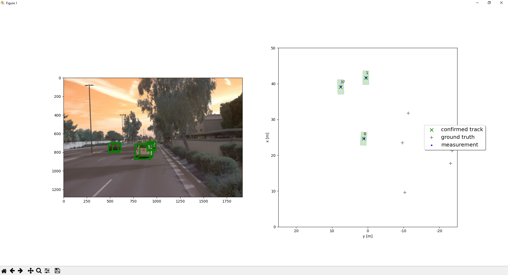

# Final project - Sensor Fusion and Object Detection
To enable robust object tracking, I implemented an Extended Kalman Filter (EKF) for state estimation using LiDAR measurements. The EKF effectively handled nonlinearities in both the motion and measurement models, maintaining accurate estimates of object positions and velocities along with their associated uncertainties. A track management system was developed to maintain a dynamic list of active tracks—new tracks were initialized from unassigned measurements, while tracks with low confidence or prolonged periods of missing data were removed. This ensured stable and continuous tracking over time.

For data association, I applied a gating technique combined with a nearest-neighbor approach, using the Mahalanobis distance to probabilistically match incoming measurements to existing tracks based on their uncertainties. To enrich the tracking framework, LiDAR data was fused with camera-based object classification. While LiDAR provided accurate spatial and depth information, the camera added semantic context, resulting in a more complete and informative tracking output.

## Benefits from LiDAR-Camera Fusion

In theory, fusing LiDAR and camera data leverages the complementary strengths of both sensors—LiDAR provides precise range and geometric information, while the camera contributes rich texture and semantic details. This combination enhances robustness under varying conditions, such as low light, where LiDAR remains reliable, and long-range detection, where the camera can resolve smaller, distant objects. In practice, this fusion led to noticeably improved object classification in the project, enabling clearer distinctions between pedestrians, cyclists, and vehicles. It also contributed to better track continuity, especially in cases where one sensor experienced occlusion or limited coverage.

## Challenges in Real-Life Scenarios
- Sensor misalignment or calibration drift
- Environmental factors: glare, rain, fog, or night driving can affect one or both sensors.
- Real-time processing requirements: fusion systems must operate at high frequency.
- Sensor failure or noise: requires robust fault tolerance.

## Ideas for Future Improvements
- Use deep learning-based data association to improve robustness in complex scenes.
- Improve sensor calibration and use dynamic calibration correction methods.
- Incorporate temporal smoothing using motion priors or trajectory prediction.
- Fuse with additional sensors for redundancy and robustness

