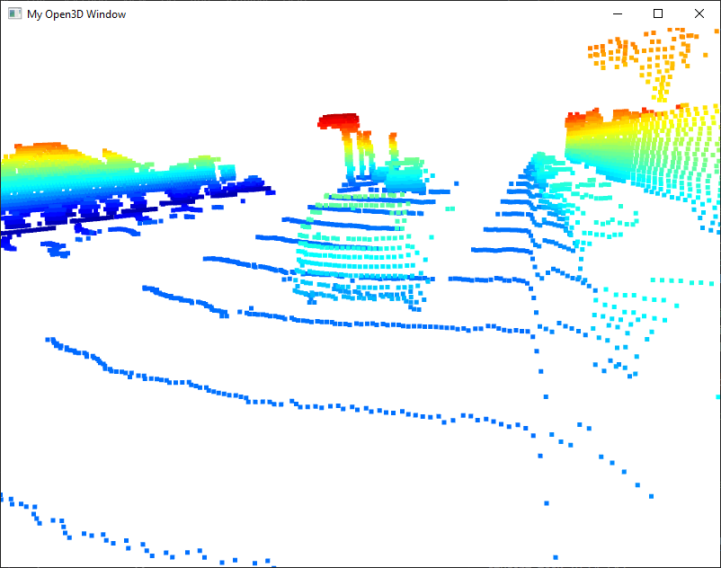
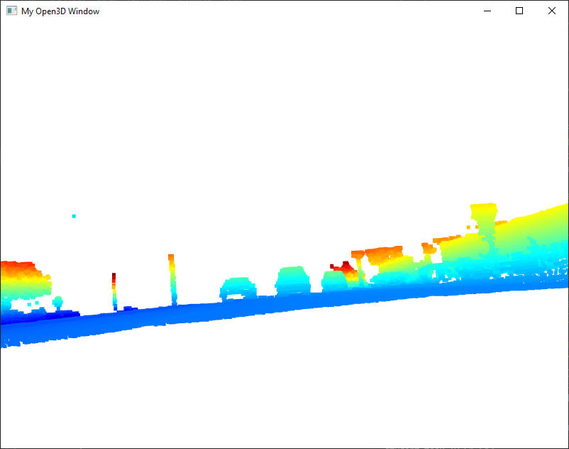

# Mid-term project - Visualize point-cloud

The following task involve analyzing point-cloud data to assess vehicle visibility and identify consistent visual features across different examples:

The defined width of a vehicle can serve as a reliable pattern, as most cars exhibit a consistent lateral span that helps distinguish them from other objects in the point-cloud.

Another useful feature for vehicle detection in point-cloud data is the rear window, which often appears as a distinct flat surface and maintains a consistent position and shape across different vehicle types.

Point-cloud images often reveal distinct patterns that aid in vehicle detection; for instance, at certain heights, the presence of two wheels becomes a consistent and recognizable feature.

